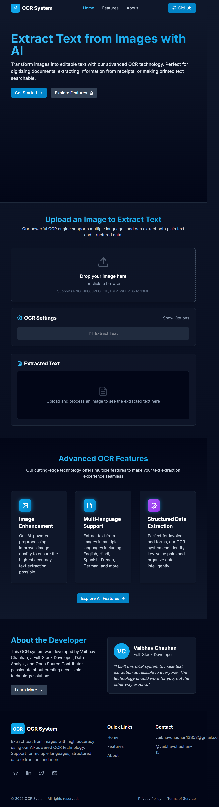
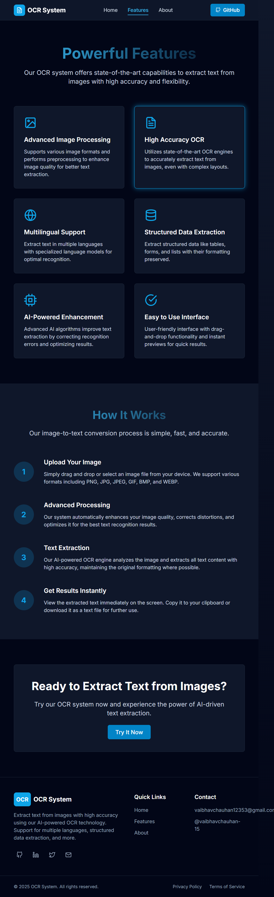
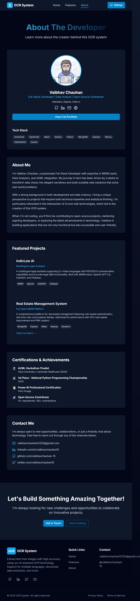

# 🔍 Image to Text Generator

<div align="center">
  
  <br/>
  <p><i>Transform any image into editable and searchable text with advanced OCR technology</i></p>
  <br/>

  [](https://nextjs.org/)
  [](https://fastapi.tiangolo.com/)
  [](https://github.com/PaddlePaddle/PaddleOCR)
  [](https://www.typescriptlang.org/)
  [](https://tailwindcss.com/)
  [](https://www.docker.com/)
</div>

<hr />

## 📋 Table of Contents
- [Overview](#-overview)
- [Features](#-features)
- [Technology Stack](#-technology-stack)
- [Screenshots](#-screenshots)
- [Getting Started](#-getting-started)
- [Project Structure](#-project-structure)
- [API Endpoints](#-api-endpoints)
- [Configuration](#-configuration)
- [Contributing](#-contributing)
- [License](#-license)

<hr />

## 🚀 Overview

<div align="center">
  
</div>

**Image to Text Generator** is a powerful OCR (Optical Character Recognition) system that extracts text from images with high accuracy. Whether you need to digitize documents, extract text from screenshots, or make images searchable, this application provides a user-friendly interface with advanced features.

The system combines a modern Next.js frontend with a robust FastAPI backend, utilizing PaddleOCR's state-of-the-art recognition capabilities to deliver excellent results across multiple languages and image types.

<hr />

## ✨ Features

<div align="center">
  
</div>

<table>
  <tr>
    <td width="50%">
      <h3>🖼️ Image Processing</h3>
      <ul>
        <li>Support for various image formats (PNG, JPG, JPEG, GIF, BMP, WEBP)</li>
        <li>Automatic image enhancement and preprocessing</li>
        <li>Deskewing and noise reduction</li>
        <li>10MB file size support</li>
      </ul>
    </td>
    <td width="50%">
      <h3>📝 Text Extraction</h3>
      <ul>
        <li>High-accuracy text recognition</li>
        <li>Multi-language support</li>
        <li>Confidence score for extraction quality</li>
        <li>Word count and processing statistics</li>
      </ul>
    </td>
  </tr>
  <tr>
    <td width="50%">
      <h3>🔄 Data Processing</h3>
      <ul>
        <li>Structured data extraction (key-value pairs)</li>
        <li>Copy to clipboard functionality</li>
        <li>Download results as TXT file</li>
        <li>JSON data format option</li>
      </ul>
    </td>
    <td width="50%">
      <h3>🛠️ Advanced Options</h3>
      <ul>
        <li>Language selection</li>
        <li>Toggle image enhancement</li>
        <li>Structured output formatting</li>
        <li>Real-time processing feedback</li>
      </ul>
    </td>
  </tr>
</table>

<hr />

## 💻 Technology Stack

<table>
  <tr>
    <td width="50%">
      <h3>Frontend</h3>
      <ul>
        <li>Next.js 13 with App Router</li>
        <li>TypeScript</li>
        <li>TailwindCSS</li>
        <li>React Dropzone</li>
        <li>Axios</li>
        <li>React Icons</li>
      </ul>
    </td>
    <td width="50%">
      <h3>Backend</h3>
      <ul>
        <li>FastAPI</li>
        <li>PaddleOCR</li>
        <li>OpenCV</li>
        <li>NumPy</li>
        <li>Pillow (PIL)</li>
        <li>Uvicorn</li>
      </ul>
    </td>
  </tr>
  <tr>
    <td width="50%">
      <h3>Deployment</h3>
      <ul>
        <li>Docker</li>
        <li>Docker Compose</li>
        <li>CORS Middleware</li>
        <li>Environment Configuration</li>
      </ul>
    </td>
    <td width="50%">
      <h3>Development Tools</h3>
      <ul>
        <li>ESLint</li>
        <li>TypeScript</li>
        <li>Tailwind Forms & Typography</li>
        <li>Next Themes (dark mode support)</li>
      </ul>
    </td>
  </tr>
</table>

<hr />

## 📸 Screenshots

<div align="center">
  <table>
    <tr>
      <td><strong>Home Page</strong></td>
      <td><strong>Features Page</strong></td>
    </tr>
    <tr>
      <td></td>
      <td></td>
    </tr>
    <tr>
      <td><strong>About Page</strong></td>
      <td><strong>Text Extraction Result</strong></td>
    </tr>
    <tr>
      <td></td>
      <td></td>
    </tr>
  </table>
</div>

<hr />

## 🚦 Getting Started

### Prerequisites
- Docker and Docker Compose
- Node.js (v16+) for local development
- Python (3.9+) for local development

### Using Docker (Recommended)

```bash
# Clone the repository
git clone https://github.com/vaibhavchauhan-15/OCR-System---Image-to-Text-Generator-.git
cd image-to-text-generator

# Start the application with Docker Compose
docker-compose up --build
```

The application will be available at:
- Frontend: http://localhost:3000
- Backend API: http://localhost:8000
- API Documentation: http://localhost:8000/docs

### Manual Setup

#### Backend
```bash
cd backend

# Create a virtual environment
python -m venv venv
source venv/bin/activate  # On Windows: venv\Scripts\activate

# Install dependencies
pip install -r requirements.txt

# Start the server
python -m app.main
```

#### Frontend
```bash
cd frontend

# Install dependencies
npm install

# Start development server
npm run dev
```

<hr />

## 📁 Project Structure

```
image-to-text-generator/
├── backend/                # FastAPI backend
│   ├── app/
│   │   ├── api/            # API endpoints
│   │   ├── core/           # Core configurations
│   │   ├── models/         # Data models and schemas
│   │   └── services/       # Business logic services
│   ├── Dockerfile          # Backend Docker configuration
│   └── requirements.txt    # Python dependencies
├── frontend/               # Next.js frontend
│   ├── public/             # Static assets
│   ├── src/
│   │   ├── app/            # Next.js App Router
│   │   └── components/     # React components
│   ├── Dockerfile          # Frontend Docker configuration
│   └── package.json        # Node.js dependencies
└── docker-compose.yml      # Docker Compose configuration
```

<hr />

## 🔌 API Endpoints

| Endpoint | Method | Description |
|----------|--------|-------------|
| `/api/health` | GET | Check API health status |
| `/api/extract` | POST | Extract text from an image |
| `/api/batch-extract` | POST | Extract text from multiple images (batch processing) |
| `/api/supported-languages` | GET | Get list of supported languages for OCR |

For detailed API documentation, visit `/docs` when the server is running.

<hr />

## ⚙️ Configuration

### Environment Variables

#### Backend
- `APP_NAME`: Application name
- `APP_VERSION`: Application version
- `CORS_ORIGINS`: Allowed CORS origins
- `MAX_UPLOAD_SIZE`: Maximum upload file size in bytes
- `UPLOAD_DIR`: Directory for uploaded files

#### Frontend
- `NEXT_PUBLIC_API_URL`: Backend API URL

<hr />

## 🤝 Contributing

Contributions are welcome! Please feel free to submit a Pull Request.

1. Fork the repository
2. Create your feature branch (`git checkout -b feature/amazing-feature`)
3. Commit your changes (`git commit -m 'Add some amazing feature'`)
4. Push to the branch (`git push origin feature/amazing-feature`)
5. Open a Pull Request

<hr />

## 📄 License

This project is licensed under the MIT License - see the LICENSE file for details.

<hr />

<div align="center">
  <p>
    <a href="https://github.com/vaibhavchauhan-15/OCR-System---Image-to-Text-Generator-">
      
    </a>
    &nbsp;
    <a href="https://github.com/vaibhavchauhan-15/OCR-System---Image-to-Text-Generator-/issues">
      
    </a>
  </p>
  <p>
    <strong>Built with ❤️ by <a href="https://github.com/vaibhavchauhan-15">Vaibhav Chauhan</a></strong>
  </p>
  
  <a href="#-image-to-text-generator">Back to top ⬆️</a>
</div>
