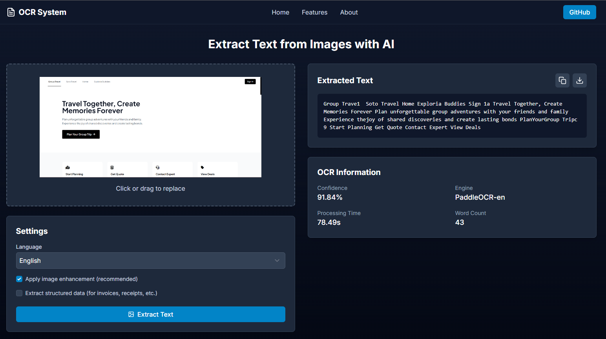

# 🔍 OCR System - Image to Text Generator ✨

<div align="center">



</div>

> ✨ An AI-powered OCR system that extracts text from images with high accuracy, supporting documents, receipts, number plates, invoices, and more.

## ✨ Features

<div align="center">

| 🚀 Feature | 📝 Description |
| :--- | :--- |
| 🔍 **High Accuracy OCR** | Google Vision OCR API + PaddleOCR fallback |
| 🌎 **Multi-Language Support** | 100+ languages (English, Hindi, etc.) |
| 🖼️ **Document Preprocessing** | Noise removal, deskew, binarization using OpenCV |
| 📚 **Batch Processing** | Handle multiple files at once |
| ✏️ **Handwriting Recognition** | Google Vision API support |
| 📋 **Structured Output** | JSON (useful for invoices, receipts, forms) |
| 📱 **Real-time OCR** | Option for live camera OCR |
| 📄 **Searchable PDFs** | Convert scanned PDFs to text-based PDFs |

</div>

## 🛠️ Tech Stack

<div align="center">

| 🔧 Component | 💻 Technologies |
| :--- | :--- |
| **Backend** |     |
| **Preprocessing** |   |
| **Frontend** |   |
| **Deployment** |  |

</div>

## 🚀 Installation & Setup

### 1. Clone the Repository
```bash
# Get the code
git clone https://github.com/yourusername/image-to-text-generator.git
cd image-to-text-generator
```

### 2. Backend Setup
```bash
cd backend
python -m venv venv
venv\Scripts\activate  # Windows
# or source venv/bin/activate  # Linux/Mac

pip install -r requirements.txt
```

### 3. Configure Google Vision API
1. Create a project on Google Cloud Platform (GCP)
2. Enable Vision API
3. Download JSON credentials file
4. Set environment variable:
```bash
# Windows (PowerShell)
$env:GOOGLE_APPLICATION_CREDENTIALS="path\to\credentials.json"

# Linux/Mac
export GOOGLE_APPLICATION_CREDENTIALS="path/to/credentials.json"
```

### 4. Start the Backend
```bash
cd backend
uvicorn app.main:app --reload
```

### 5. Frontend Setup
```bash
cd frontend
npm install
npm run dev
```

## 🔌 API Endpoints

### 📡 POST /api/extract
Extract text from an uploaded image with high accuracy.

**Request:**
```json
{
  "file": "document.png",
  "language": "en",
  "enhance_image": true,
  "structured_output": false
}
```

**Response:**
```json
{
  "text": "Invoice Number: 12345\nDate: 2025-08-20\nAmount: $250",
  "confidence": 0.98,
  "language": "en",
  "engine_used": "Google Vision API",
  "structured_data": {
    "key_value_pairs": {
      "Invoice Number": "12345",
      "Date": "2025-08-20",
      "Amount": "$250"
    }
  },
  "processing_time": 0.542,
  "word_count": 6
}
```

## 📝 License

MIT License – Free to use and modify.

---

<div align="center">

### 🌟 Star this repository if you find it useful! 🌟


</div>
